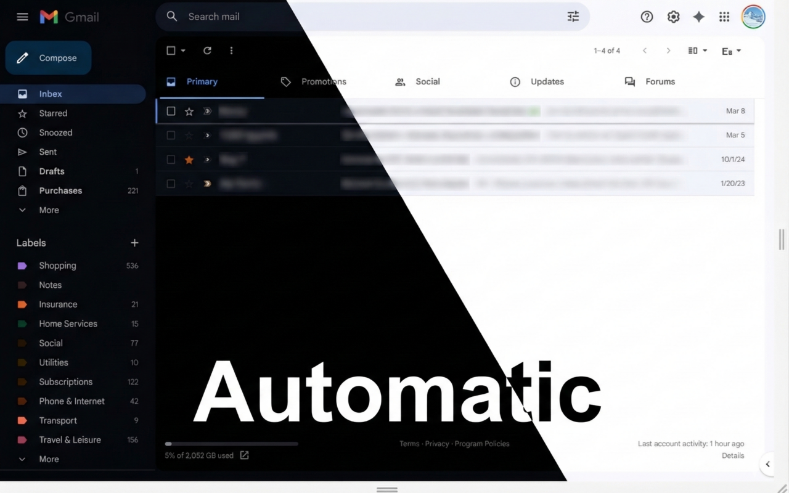

# Gmail Auto Dark Mode

Tired of bright white Gmail hurting your eyes at night? **Gmail Auto Dark Mode** automatically gives Gmail a dark theme whenever your operating system is in dark mode — and switches back to light the moment you do.



## Why install it?

- **Zero effort.** No buttons, no settings. Just install it and it follows your OS preference automatically.
- **Real-time switching.** Change your system theme and Gmail updates instantly — no page reload needed.
- **Images stay true.** Photos and videos are counter-inverted so they always look the way they should.
- **Survives Gmail navigation.** A smart observer reapplies the theme after Gmail's internal page transitions so dark mode never unexpectedly disappears.
- **No permissions required.** The extension cannot read your emails, access your account, or communicate with any server. Everything runs locally in your browser.
- **Tiny footprint.** A single lightweight script — no background processes, no memory overhead.

## How it works

The extension injects a CSS `filter: invert(1) hue-rotate(180deg)` rule into Gmail as soon as the page loads. It reads the OS-level color preference (`prefers-color-scheme`) via the standard Web API and listens for changes in real time. Images, videos, and canvases are counter-inverted to restore their original appearance. A `MutationObserver` watches for Gmail's SPA navigation and reapplies the theme if it is ever removed.

To activate dark mode, make sure your OS is set to dark mode (see [How to enable dark mode on your OS](#how-to-enable-dark-mode-on-your-os) below).

## Installation

### From the Chrome Web Store

_(Coming soon)_

### Manual installation (developer mode)

1. Clone or download this repository.
2. Open Chrome and go to `chrome://extensions`.
3. Enable **Developer mode** (top-right toggle).
4. Click **Load unpacked** and select the **`extension/`** subfolder (not the repo root).

## How to enable dark mode on your OS

The extension activates automatically when your system is set to dark mode. Here's how to switch on each platform:

### macOS
1. Open **System Settings** (Apple menu → System Settings).
2. Go to **Appearance**.
3. Select **Dark** (or **Auto** to follow sunrise/sunset).

### Windows 11 / 10
1. Open **Settings** (Win + I).
2. Go to **Personalization → Colors**.
3. Under **Choose your mode**, select **Dark**.

### Ubuntu (GNOME)
```bash
gsettings set org.gnome.desktop.interface color-scheme 'prefer-dark'
```
To switch back to light mode:
```bash
gsettings set org.gnome.desktop.interface color-scheme 'prefer-light'
```
Alternatively, use **Settings → Appearance** and select **Dark**.

## Permissions

This extension requests **no permissions**. It only injects CSS into `https://mail.google.com/*` and reads the system color scheme — no data is collected or transmitted.

## Privacy

This extension collects no user data whatsoever. All processing happens locally in your browser. See the full [Privacy Policy](PRIVACY.md).

## Contributing

Pull requests are welcome. For major changes, please open an issue first to discuss what you'd like to change.

## Development

Packaging the extension:

```bash
zip -r gmail-auto-dark-mode.zip extension/
```

## License

[MIT](LICENSE)
