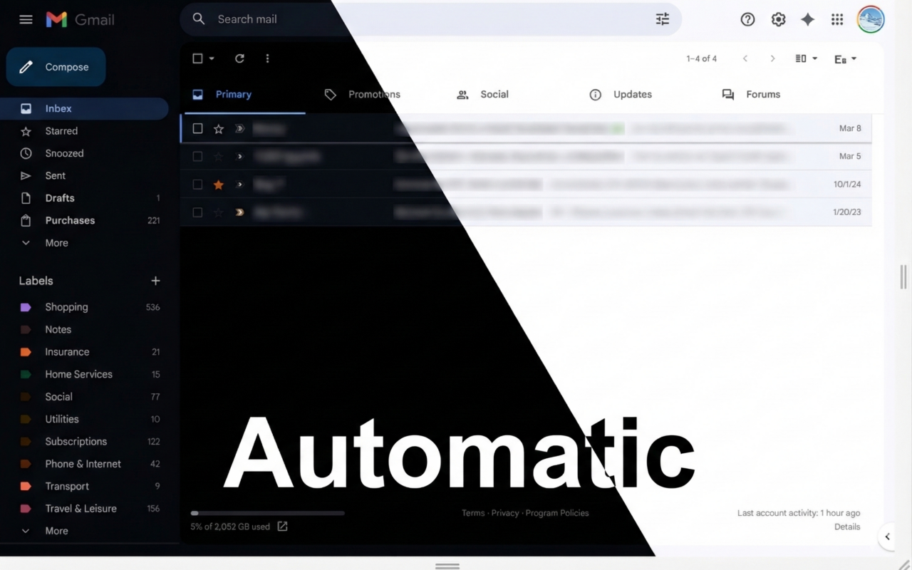

# Gmail Auto Dark Mode

Automatically applies a dark theme to Gmail when your OS is in dark mode — and reverts instantly when you switch back.



## Features

- Follows your OS dark mode preference automatically — no buttons or settings
- Switches in real time without a page reload
- Counter-inverts images, videos, and icons in emails, chats, and side panel companion apps (Keep, Calendar, Tasks, Contacts) so they look normal
- Reapplies the theme after Gmail's internal navigation via a `MutationObserver`
- No data collected — nothing is read, stored, or transmitted

## How it works

Injects a dark theme style adjustment into Gmail on load, driven by the `prefers-color-scheme` Web API. Images, videos, canvases, and icons in Gmail and its integrated side panel companion apps (like Keep, Calendar, Tasks, Contacts) are mathematically counter-inverted to preserve -as much as possible- their original colors and appearance.

## Installation

### Chrome Web Store

[](https://chromewebstore.google.com/detail/gmail-auto-dark-mode/gdpghafiebdcfbkdimnllfimfjllaifb)

### Manual (developer mode)

1. Clone or download this repo.
2. Go to `chrome://extensions` and enable **Developer mode**.
3. Click **Load unpacked** and select the `extension/` subfolder.

## Enabling OS dark mode

The extension activates automatically once your system is in dark mode.

**macOS:** System Settings → Appearance → Dark

**Windows 10/11:** Settings → Personalization → Colors → Dark

**Ubuntu (GNOME):**
```bash
gsettings set org.gnome.desktop.interface color-scheme 'prefer-dark'
```

## Privacy

No data is collected or transmitted. All processing is local. See [Privacy Policy](PRIVACY.md).

## Development

```bash
zip -r gmail-auto-dark-mode.zip extension/
```

## License

[MIT](LICENSE)